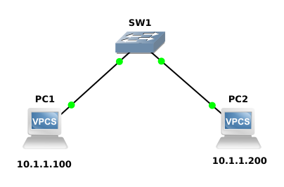

# Lab 01 - Basic Switch Connectivity (1 Switch, 2 VPCS)

## Objective

Configure two VPCS hosts connected to a Cisco Layer 2 switch and verify end-to-end connectivity.

## Topology

## Devices Used

- 1 Cisco IOS Layer 2 Switch
- 2 VPCS

## IP Addressing

| Device | IP Address | Subnet Mask |
|---------|------------|-------------|
| PC1 | 10.1.1.100 | 255.255.255.0 |
| PC2 | 10.1.1.200 | 255.255.255.0 |

## Concepts covered

- Layer 2 Switching
- IPv4 Addressing
- ARP
- MAC Address Learning
- ICMP Ping

